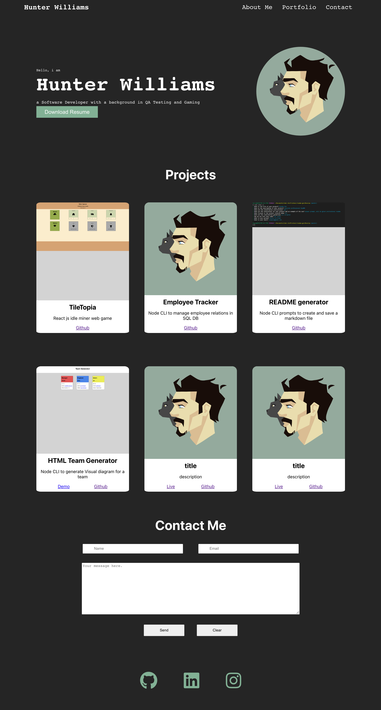

 
# live link 

# Hunter Williams React Portfolio

- header
    - dev name
    - navigation to sections in content
    - highlight current section ( about me title and section are selected default)
- content
    - about me
        - photo or avatar 
        - bio
    - portfolio
        - 6 titled images with links to deployed and github
    - contact
        - email section (name email and message)
        - validation (toast)
    - resume
        - list of proficiencies
        - downloadable resume
- footer
    - links to github and linked in
        -  and a third social